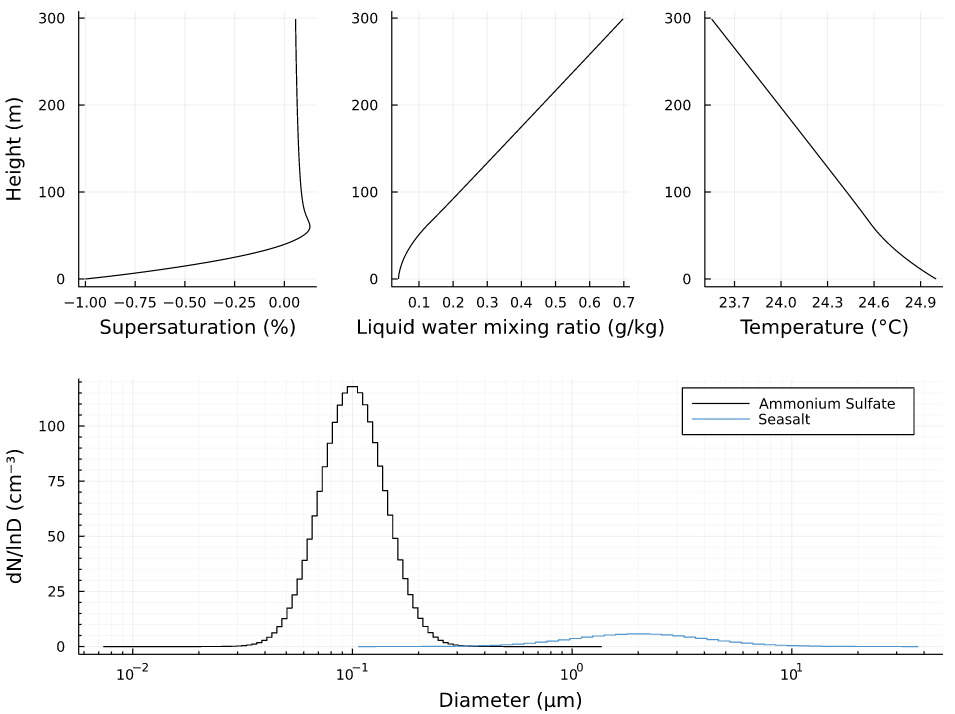

# Pyrcel.jl
Julia wrapper for the pyrcel model (https://github.com/darothen/pyrcel), which is an adiabatic cloud parcel model for studying aerosol activation.

# Purpose
This package enables running the ```pyrcel``` model within a julia environment.

# Installation

At the ```julia>``` prompt, type a ```]``` (close square bracket) to get a Julia package prompt ```pkg>```, where you can type

```julia
pkg> add git@github.com:mdp-aerosol-group/Pyrcel.jl.git
```

to install this package. The required python dependencies for the ```pyrcel``` model will be installed automatically.

# Example Usage

An complete example program to run the model with a bimodal input distribution. Detailed information about how to construct the input is provided below

```julia
using Pyrcel
using Plots
using Plots.PlotMeasures
using Printf

initial = Pyrcel.Model(298.15, 1013e2, -0.01, 1.0, 0.3)
m1 = Pyrcel.Aerosol(100.0, 0.1, 1.4, 0.6, 100, "Ammonium Sulfate")
m2 = Pyrcel.Aerosol(10.0, 2.0, 2.0, 1.3, 50, "Seasalt")
compositions = [m1, m2]

result = Pyrcel.run(compositions, initial)

p1 = plot(
    result.s,
    result.z,
    color = :black,
    xlabel = "Supersaturation (%)",
    ylabel = "Height (m)",
    label = :none,
)
p2 = plot(
    result.wc,
    result.z,
    color = :black,
    xlabel = "Liquid water mixing ratio (g/kg)",
    label = :none,
)
p3 = plot(
    result.T .- 273.15,
    result.z,
    color = :black,
    xlabel = "Temperature (°C)",
    label = :none,
)
pa = plot(p1, p2, p3, layout = grid(1, 3), bottom_margin = 20px, left_margin = 10px)
p4 = plot(
    result.psd[1].Dp,
    result.psd[1].S,
    xscale = :log10,
    xlabel = "Diameter (μm)",
    minorgrid = true,
    ylabel = "dN/lnD (cm⁻³)",
    xticks = [1e-2, 1e-1, 1e0, 1e1],
    lt = :stepmid,
    color = :black,
    label = String(result.psd[1].form),
)
p4 = plot!(
    result.psd[2].Dp,
    result.psd[2].S,
    xscale = :log10,
    color = :steelblue3,
    lt = :stepmid,
    label = String(result.psd[2].form),
)
p = plot(pa, p4, layout = grid(2, 1), size = (800, 600))

println("")
@printf("Results from parcel model run\n")
@printf("-----------------------------\n")
@printf("Updraft velocity = %.2f (m s⁻¹)\n", initial.w)
@printf("CDNC = %.1f cm⁻³\n", result.CDNC)
@printf("Maximum supersaturation = %.3f %%\n", result.smax)
@printf("Activated Fraction = %.2f\n", result.af)
display(p)
```

This program should produce the following output

```julia
Results from parcel model run
-----------------------------
Updraft velocity = 0.30 (m s⁻¹)
CDNC = 47.8 cm⁻³
Maximum supersaturation = 0.129 %
Activated Fraction = 0.43
```

And the following graph



# Detailed Instructions

The ```Model`` structure subsumes the initial conditions

```julia
struct Model
    T::Float64      # Temperature [K]
    p::Float64      # Pressure [Pa]
    S::Float64      # Initial mixing ratio [-]
    α::Float64      # Accomodation coefficient [-]
    w::Float64      # Updraft velocity [m/s]
end
```

Thus, the following line initializes the model with cloud base temperature and pressure ```T = 298.15 K```, p = ```101300 hPa```, initial saturation ratio of ```S = -0.01``` (99% RH), accomodation coefficient ```α = 1.0```, and updraft velocity ```w = 0.3 m/s".

```julia
julia> initial = Pyrcel.Model(298.15, 1013e2, -0.01, 1.0, 0.3)
```

The ```Aerosol``` structure subsumes critical information of the aerosol size distribution and chemical composition.

```julia
struct Aerosol
    N::Float64      # Number concentration [cm-3]
    μ::Float64      # Geometric mean diameter [μm]
    σ::Float64      # Geometric standard deviation [-]
    κ::Float64      # Hygroscopicity parameter [-]
    bins::Int       # Number of bins [-]
    label::String   # Name of the mode
end
```

Thus the following line initialzes a mode with total number concentration ```N = 100 cm⁻³"```, mode diameter ```Dg = 0.1 μm```, and geometric standard deviation ```σ = 1.4```. The hygroscopicity parameter ```κ = 0.6```, the size distribution is discretized using 100 size bins. The label allows the user to associate the mode with a desired composition name, here ```Ammonium Sulfate```).

```julia
julia> m1 = Pyrcel.Aerosol(100.0, 0.1, 1.4, 0.6, 100, "Ammonium Sulfate")
```

The model can be exectuted via:

```julia
julia> result = Pyrcel.run(compositions, initial)
```

where ```compositions``` is an array of one or more ```Pyrcel.Aerosol``` modes. For example 

```julia
julia> m1 = Pyrcel.Aerosol(100.0, 0.1, 1.4, 0.6, 100, "Ammonium Sulfate")
julia> m2 = Pyrcel.Aerosol(10.0, 2.0, 2.0, 1.3, 50, "Seasalt")
julia> compositions = [m1, m2]
```

The output stored in ```result``` is a named tuple containg the following

```julia
    z           # array of heights (m)
    T           # array of temperature (K)
    wc          # array of liquid water mixing ratio (g/kg)
    s           # array of supersaturation (%)
    smax        # maximum supersaturation (%)
    Nt          # total aerosol number concentration (cm-3)
    af          # activated fraction = CDNC/Nt (-) 
    CDNC        # activated cloud droplet number concentration (cm-3)
    Nds         # array of activated number concentration in each mode
    psd         # array of particle size distributions
    traces      # python object with aerosol traces returned from pyrcel model
    parcel      # python object with parcel model traces returned from pyrcel model
```

The top fields decode important information from the raw model output. Please see [pyrcel model documentation](https://pyrcel.readthedocs.io/en/latest/sci_descr.html) for details of the ```traces``` and ```parcel``` output. The output can be parsed in Julia to obtain additional information, e.g. the evolution of the size distribution with height.

The size distribution is encoded as follows

```julia
struct SizeDistribution
    A::Any                        # Input parameters [[N1,Dg1,σg1], ...] or DMA
    De::Vector{<:AbstractFloat}   # bin edges
    Dp::Vector{<:AbstractFloat}   # bin midpoints
    ΔlnD::Vector{<:AbstractFloat} # ΔlnD of the grid
    S::Vector{<:AbstractFloat}    # spectral density
    N::Vector{<:AbstractFloat}    # number concentration per bin
    form::Symbol                  # form of the size distribution [:lognormal, ....]
end
```

The encoding is identical to/compatible with the representation in [DifferentialMobilityAnalyzers.jl](https://mdpetters.github.io/DifferentialMobilityAnalyzers.jl/stable/). The results structure returns an array of ```SizeDistribution``` corresponding to the inital aerosol size distribution. Thus each mode can be investigated via

```julia
julia> result.psd[1].Dp # midpoints
julia> result.psd[1].S  # spectral density
```

Please see the plotting for how this information can be used to evaluate the results.